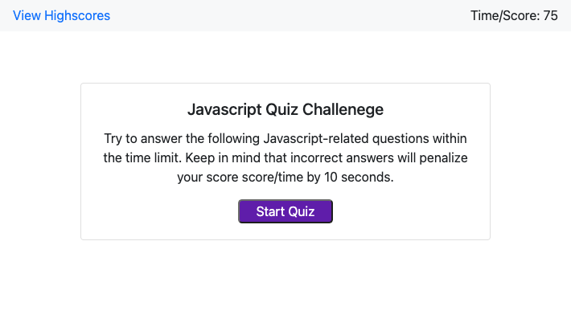
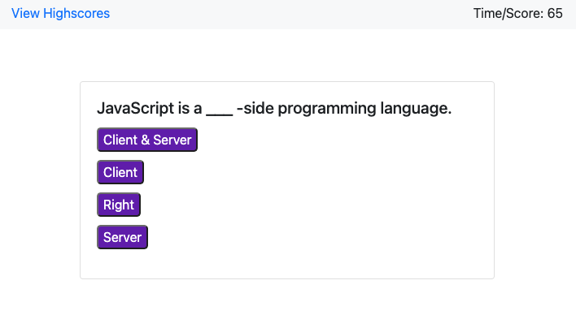
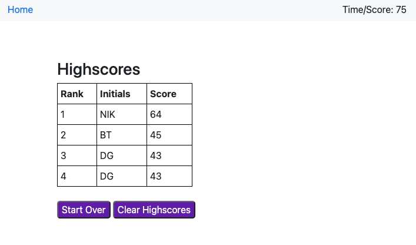

# JavascriptQuizApp

A quiz app that contains 5 Javascript-related questions. Click the 'Start Quiz' button to start the quiz. Once the quiz is completed, users may input their intials to save their score to the highscores list.

## Technologies

- HTML5
- CSS
- Javascript
- Bootstrap v4.5.3
- VSCode
- Git

## Mock-Up

- Homepage

- Quiz question page

- Highscores page

## Demo

- https://nvandenberge.github.io/JavascriptQuizApp/
